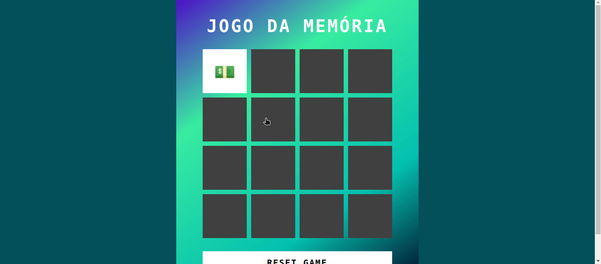

# Jogo da Memória

  

Esse jogo foi desenvolvido durante o Bootcamp: Potência Tech iFood - Desenvolvimento de Jogos

### Tecnologias Utilizadas

- HTML5 e CSS3:
  - Para a estrutura e aparência do jogo.
- JavaScript:
  - Para a lógica de programação e interatividade.
- Emojis:
  - Usados para criar a estética dos cartões.